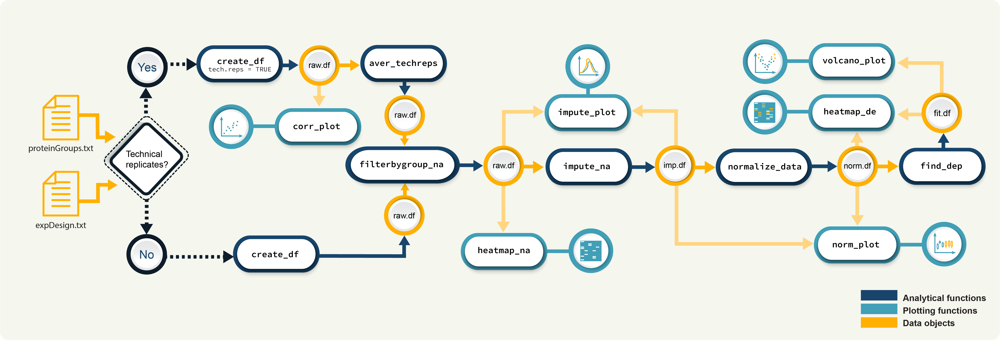
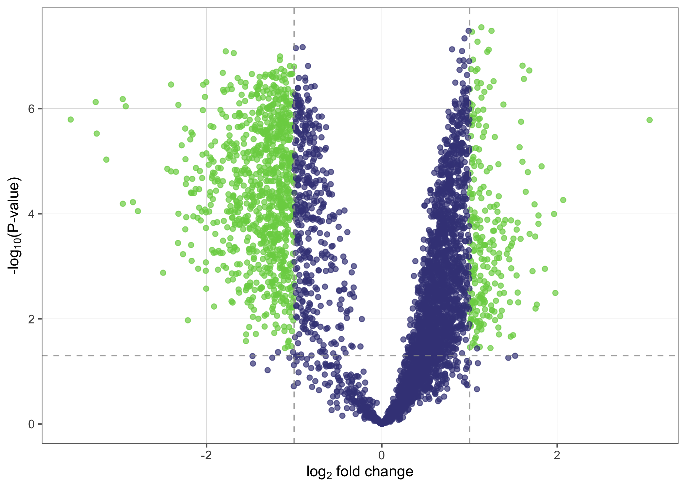

-   [promor](#promor)
    -   [Installation](#installation)
    -   [Proteomics data analysis with
        promor](#proteomics-data-analysis-with-promor)
    -   [Example](#example)
    -   [Tutorials](#tutorials)

<!-- README.md is generated from README.Rmd. Please edit that file -->

# promor

### A comprehensive R package for proteomics data analysis and modeling

<!-- badges: start -->
<!-- badges: end -->

*promor* is an R package that combines proteomics data analysis with
machine learning-based modeling. The input for *promor* is the
*proteinGroups.txt* file produced by *MaxQuant* and an *expDesign.txt*
file, which contains the experimental design.  
*promor* provides a wealth of data analysis and visualization tools at
the protein level to analyze label-free proteomics data.

## Installation

You can install the development version of promor from
[GitHub](https://github.com/) with:

``` r
# install.packages("devtools")
devtools::install_github("caranathunge/promor")
```

Alternatively, *promor* can be installed directly from a source. First,
you need to download and save the package files in a local directory.
Then you may install *promor* as follows:

``` r
install.packages("path/to/promor", repos = NULL, type = "source", dependencies = TRUE)
```

Note: Full path and file name should be provided as “path/to/promor.”
For example, if promor is saved on your C drive, it could be :
`"C://promor_0.1.0.tar.gz"`

## Proteomics data analysis with promor


*Figure 1. A schematic diagram of suggested workflows for proteomics
data analysis with promor.*

## Example

Here is a minimal working example that shows how to identify
differentially expressed proteins between multiple conditions with five
simple steps in *promor*. We use a previously published data set from
[Cox et al. (2014)](https://europepmc.org/article/MED/24942700#id609082)

``` r
#Load promor
library(promor)
#Create a raw.df object with the files provided in extdata folder.
raw <- create.df(prot.groups = system.file("extdata", "ecoli_proteinGroups.txt", 
                                           package = "promor"), 
                 exp.design = system.file("extdata", "expDesign.txt", 
                                          package = "promor"))
#Filter out proteins with high levels of missing data in each condition.
raw_1 <- filterby.groupNA(raw)
#Impute missing data
imp_df <- impute.NA(raw_1)
#Normalize data
norm_df <- normalize.data(imp_df)
#Perform differential expression analysis
fit_df <- find.DEP(norm_df)
```

Lets take a look at the results using a volcano plot.

``` r
volcano.plot(fit_df)
```



## Tutorials

You can choose a tutorial from the list below that best fits your
experiment and the structure of your proteomics data.

-   If your data does NOT contain technical replicates, you can refer to
    the following tutorial.

``` r
vignette("promor_with_notechreps", package="promor")
```

-   If your data contains technical replicates, you can refer to the
    following tutorial for an illustrative example.

``` r
vignette("promor_with_techreps", package="promor")
```

-   If you would like to perform modeling with specific proteins from
    your data set to test their predictive performance, you may refer to
    the following tutorial.

``` r
vignette("modeling_with_promor", package="promor")
```

#### Copies of the vignettes can be found here:

-   [promor](http://promor.html) Will add these to a github repository
    and link them here later

#### Citation

[Journal](https://www.blabla) Link to preprint or actual article once
this is published
