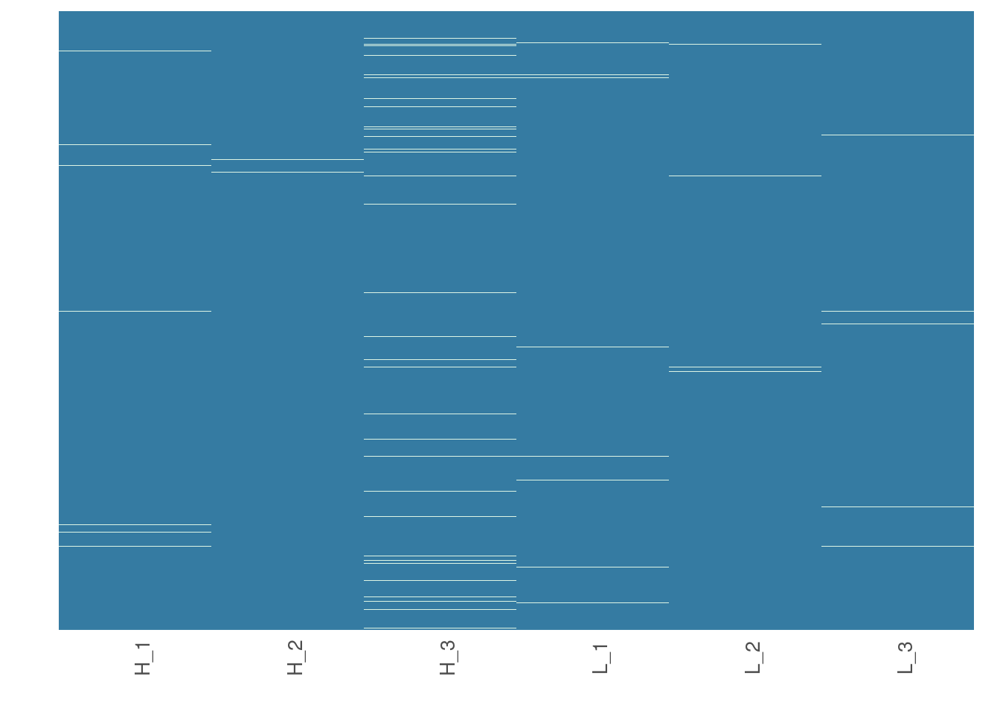
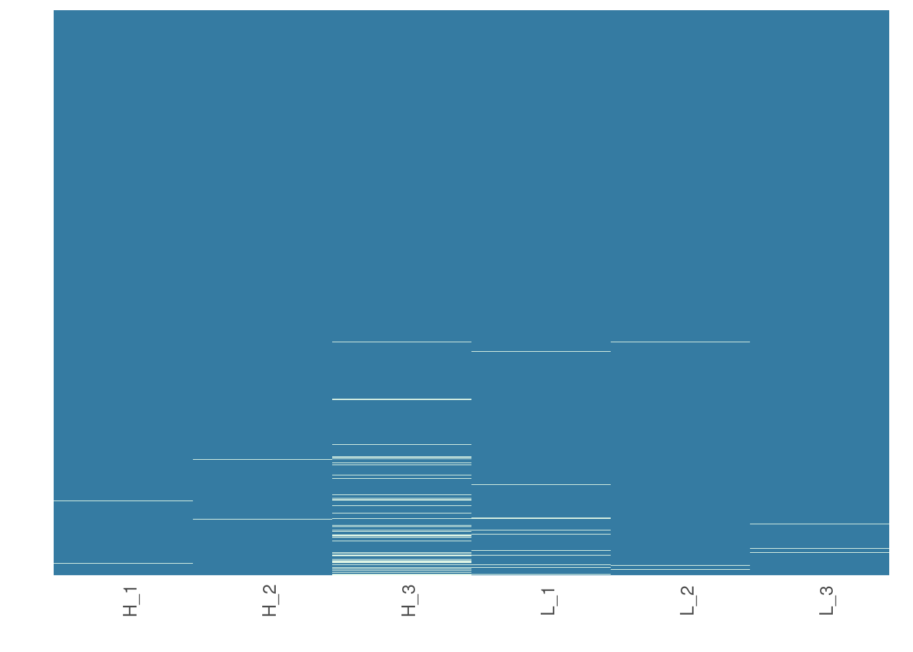
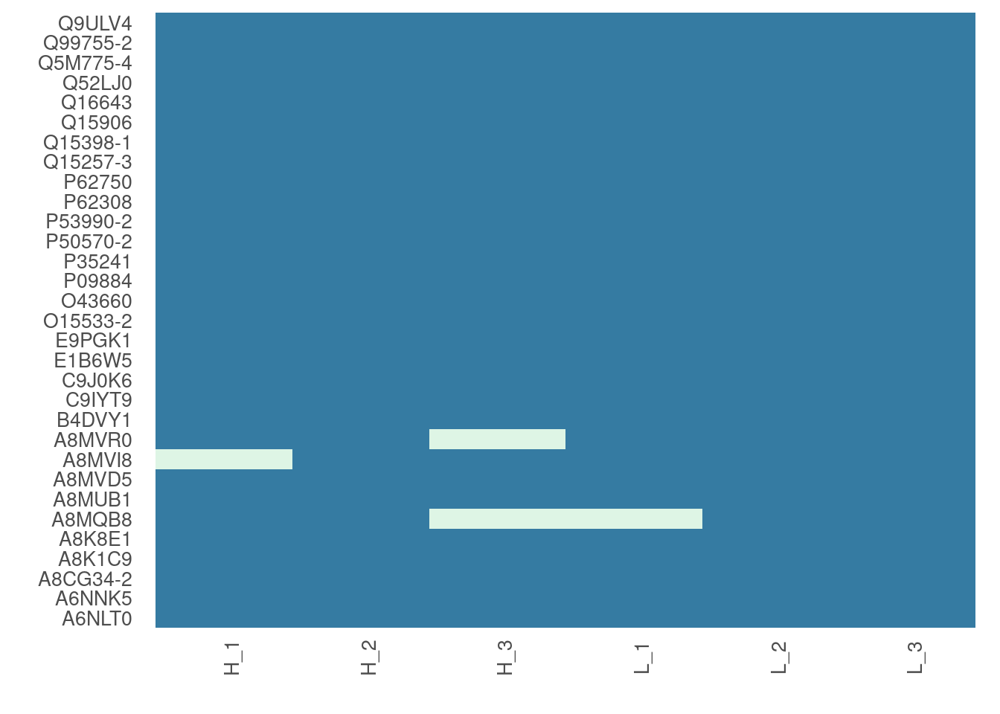
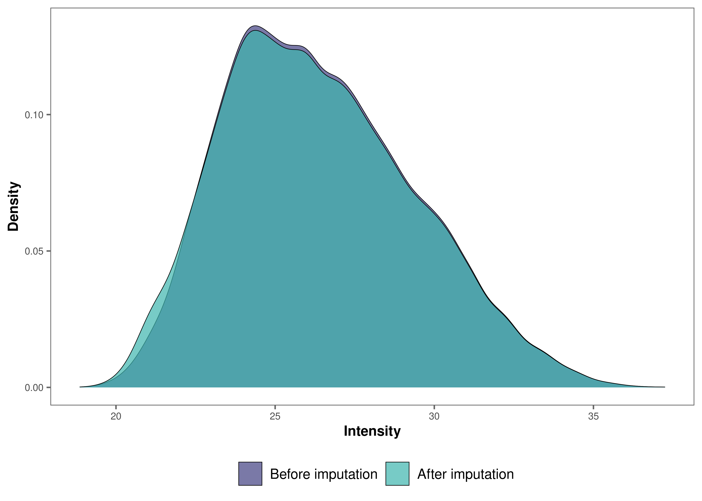
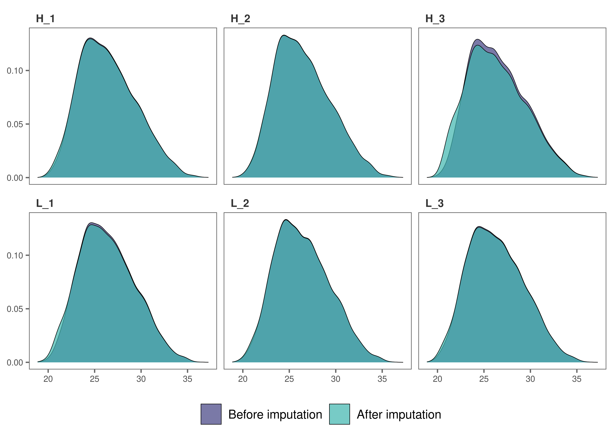
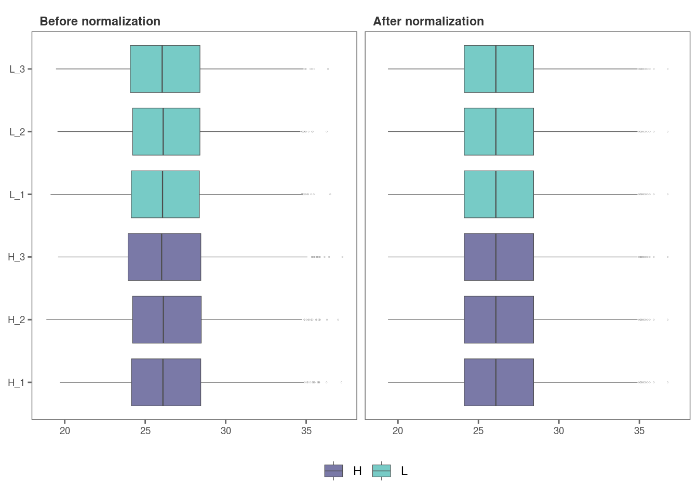
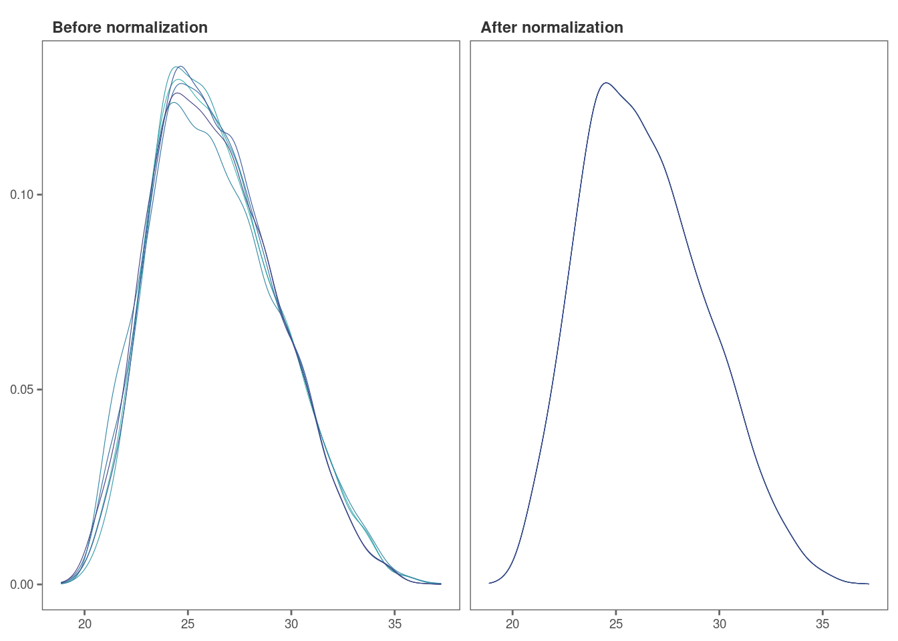
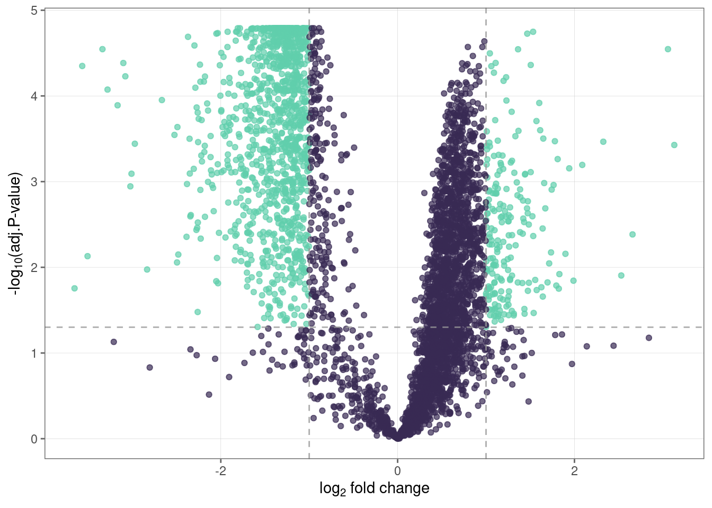

# Proteomics data analysis: no technical replicates)

### Introduction

This tutorial shows how you can use `promor` to analyse label-free
quantification (LFQ) proteomics data that do **NOT** contain technical
replicates.

We recommend that you first go through the simple working example
provided in **Introduction to promor** to get acquainted with `promor's`
functionality.

``` r
vignette("intro_to_promor")
```

A tutorial for proteomics data **containing technical replicates** is
provided here: [promor: Technical
replicates](https://caranathunge.github.io/promor/articles/promor_with_techreps.html)

For this tutorial we will be using a previously published data set from
[Cox et
al. (2014)](https://europepmc.org/article/MED/24942700#id609082).  

------------------------------------------------------------------------

### Workflow

*Figure 1.
A schematic diagram highlighting the suggested promor workflow for
proteomics data without technical replicates*

**You can access the help pages for functions shown above and more
using** `?function_name`

------------------------------------------------------------------------

### Input data

To run `promor`, you need:

- A **proteinGroups.txt** file produced by *MaxQuant* or a **standard
  input file** containing a quantitative matrix of protein intensities.
- An **expDesign.txt** file that contains the experimental design.

**proteinGroups.txt** is one of the output files generated by *MaxQuant*
program. It is a tab-delimited file that contains information on
identified proteins from your peptide data. More information on its
contents can be found in [MaxQuant
Documentation](http://coxdocs.org/doku.php?id=maxquant:table:proteingrouptable).  

**Standard input file** should be a tab-delimited text file. Proteins or
protein groups should be indicated by rows and samples by columns.
Protein names should be listed in the first column and you may use a
column name of your choice for the first column. The remaining sample
column names should match the sample names indicated by the mq_label
column in the expDesign.txt file.  

**expDesign.txt** file is a tab-delimited text file that contains the
design of your experiment. Note that you will have to create and provide
this file when you run `promor` with your own data. Let’s take a look at
the sample *expDesign.txt* file that we will be using for this tutorial.

``` r
# Load promor
library(promor)
# Let's load the expDesign.txt file
exp_design <- read.csv("https://raw.githubusercontent.com/caranathunge/promor_example_data/main/ed1.txt", sep = "\t")
# Take a peek inside the file
head(exp_design)
```

**mq_label** is the sample label that you provided when running
*MaxQuant*. You can easily find them in your *proteinGroups.txt* file.
Hint: In LFQ intensity columns, the term “LFQ intensity” is immediately
followed by the label you provided when running *MaxQuant*. This is your
**mq_label**. If you are using a **standard input file** instead of a
proteinGroups.txt file, **mq_label** should match the column headers of
the sample columns.

**condition** is the condition or group that your samples belong to. In
this example “H” refers to HeLa cells, and “L” refers to *E. coli*
cells.

**sample_ID** is a unique identifier for each sample.

**tech_rep** is a number denoting the technical replicate number. In
this example, there are no technical replicates, so the column is left
blank.

------------------------------------------------------------------------

### 1. Create a *raw_df* object

Let’s first create a *raw_df* object with the input files. Here we are
using a proteinGroups.txt file and an expDesign.txt file. The default
intensity data type to use is “LFQ”, so LFQ intensity columns are
extracted from the proteinGroups.txt file.

``` r
# Create a raw_df object with default settings.
raw <- create_df(
  prot_groups = "https://raw.githubusercontent.com/caranathunge/promor_example_data/main/pg1.txt",
  exp_design = "https://raw.githubusercontent.com/caranathunge/promor_example_data/main/ed1.txt"
)
#> 0 empty row(s) removed.
#> 0 empty column(s) removed.
#> 80 protein(s) (rows) only identified by site removed.
#> 65 reverse protein(s) (rows) removed.
#> 42 protein potential contaminant(s) (rows) removed.
#> 1923 protein(s) identified by 2 or fewer unique peptides removed.
#> Zeros have been replaced with NAs.
#> Data have been log-transformed.


# We can quickly check the dimensions of the data frame
dim(raw)
#> [1] 4584    6
```

Instead of using **LFQ** intensity values, you can choose to extract
other data types such as **iBAQ** from the proteinGroups.txt file as
follows:

``` r
# Create a raw_df object of ibaq values
raw_1 <- create_df(
  prot_groups = "https://raw.githubusercontent.com/caranathunge/promor_example_data/main/pg1.txt",
  exp_design = "https://raw.githubusercontent.com/caranathunge/promor_example_data/main/ed1.txt",
  data_type = "iBAQ"
)
#> 0 empty row(s) removed.
#> 0 empty column(s) removed.
#> 80 protein(s) (rows) only identified by site removed.
#> 65 reverse protein(s) (rows) removed.
#> 42 protein potential contaminant(s) (rows) removed.
#> 1923 protein(s) identified by 2 or fewer unique peptides removed.
#> Zeros have been replaced with NAs.
#> Data have been log-transformed.


# We can quickly check the first five rows of the data frame
head(raw_1)
```

Instead of using a proteinGroups.txt file, you can choose to use a
standard input file containing a quantitative matrix of protein
intensities.

``` r
# Create a raw_df object using a standard input file.
raw_2 <- create_df(
  prot_groups = "https://raw.githubusercontent.com/caranathunge/promor_example_data/main/st.txt",
  exp_design = "https://raw.githubusercontent.com/caranathunge/promor_example_data/main/ed1.txt",
  input_type = "standard"
)
#> 0 empty row(s) removed.
#> 0 empty column(s) removed.
#> Zeros have been replaced with NAs.
#> Data have been log-transformed.


#check the first five rows of the data frame
head(raw_2)
```

If you ran `create_df` with default settings using either type of input
files, now your *raw_df* object contains log2 transformed protein
intensity values. Run
[`?create_df`](https://caranathunge.github.io/promor/reference/create_df.md)
for more information on available arguments.

------------------------------------------------------------------------

### 2. Filter proteins by groupwise missing data

Next, we will remove proteins if they have more than 0.4% (default is
0.33%) missing data in either group (We will be using the raw_df object
that we created with the default settings as input).

``` r
# Filter out proteins with high levels of missing data in either condition
raw_filtered <- filterbygroup_na(raw, set_na = 0.4)
#> 224 proteins with higher than 40% NAs in at least one group removed.

# We can check the dimensions of the new data frame. Note that the number of rows have changed.
dim(raw_filtered)
#> [1] 4360    6
```

------------------------------------------------------------------------

### 3. Visualize missing data

Now, we are going to see how missing data is distributed in the data.
This will help us make an informed decision on how to impute missing
data in the next step.

``` r
# Visualize missing data in a subset of proteins.
heatmap_na(raw_filtered, palette = "mako")
```



Note that your proteins are alphabetically ordered by default, but if
you would rather order them by the mean intensity to check if proteins
with low intensities are more likely to have missing data, you can do
the following:

``` r
# Order proteins by mean intensity.
heatmap_na(raw_filtered, reorder_y = TRUE, palette = "mako")
```



For larger data sets, you can choose to visualize subsets of the data

``` r
# Visualize missing data in a subset of proteins.
heatmap_na(raw_filtered, protein_range = 40:70, label_proteins = TRUE, palette = "mako")
```



------------------------------------------------------------------------

### 4. Impute missing data

*promor* provides multiple missing data imputation methods. Default is
`minProb`, which assumes that all missing data is MNAR (Missing Not at
Random) type or left-censored missing values, and imputes them by random
draws from a Gaussian distribution centered at a minimal value. More
information about available imputation methods can be found in [Lazar et
al. (2016)](https://pubs.acs.org/doi/10.1021/acs.jproteome.5b00981).

``` r
# Impute missing data with minProb method. Don't forget to fix the random seed for reproducibility.
imp_df_mp <- impute_na(raw_filtered, seed = 327)
```

Alternatively, we can use a different imputation method as follows.

``` r
# Impute missing data with minDet method. Don't forget to fix the random seed for reproducibility.
imp_df_md <- impute_na(raw_filtered, method = "minDet", seed = 327)
```

**Note: Some missing data imputation methods such as ‘kNN’ require that
the data is normalized prior to imputation.**

------------------------------------------------------------------------

### 5. Visualize imputed data

We can now visualize the impact of imputation on the data set. Lets
check the data imputed with `minProb` method.

``` r
# Visualize the imputed data with sample-wise density plots.
impute_plot(original = raw_filtered, imputed = imp_df_mp, n_row = 3, n_col = 3, palette = "mako")
```



We can also visualize the impact of imputation on each sample’s
intensity data by setting `global = FALSE`.

``` r
# Visualize the imputed data with sample-wise density plots.
impute_plot(original = raw_filtered, imputed = imp_df_mp, global = FALSE, n_row = 3, n_col = 3, palette = "mako")
```



It looks like, for most samples, imputation has not changed the
distribution of data by much, which is a good sign.  

------------------------------------------------------------------------

### 6. Normalize data

**Note: As MaxQuant has already normalized protein intensities using the
MaxLFQ algorithm, further normalization may not be necessary for this
data set. Steps 6 and 7 are performed for visualization purposes only.**

To normalize the imputed data with the default `quantile` method:

``` r
norm_df <- normalize_data(imp_df_mp)
```

------------------------------------------------------------------------

### 7. Visualize normalized data

Let’s check the results from quantile normalization.

``` r
norm_plot(original = imp_df_mp, normalized = norm_df, palette = "mako")
```



For samples that show very little variability among them, such as those
in this data set, it may be difficult to visualize the effect of
normalization with boxplots (Remember, this data set had been already
normalized with the MaxLFQ algorithm within the MaxQuant program). Let’s
use `type = "density` to visualize the effect of normalization with
density plots instead.

``` r
norm_plot(original = imp_df_mp, normalized = norm_df, type = "density", palette = "mako")
```



------------------------------------------------------------------------

### 8. Identify differentially expressed proteins

We will be using the non-normalized `imp_df` object we created in **Step
4** to perform differential expression analysis.

``` r
fit_df <- find_dep(imp_df_mp)
#> 1294 siginificantly differentially expressed proteins found.
```

You can also choose to save the top 10 hits in a text file as follows:

``` r
fit_df <- find_dep(imp_df_mp, save_tophits = TRUE, n_top = 10)
```

------------------------------------------------------------------------

### 9. Generate a volcano plot

Let’s visualize the results from **Step 8** using a volcano plot.

``` r
volcano_plot(fit_df,
  text_size = 5,
  palette = "mako"
)
```



------------------------------------------------------------------------

### 10. Create a heatmap of differentially expressed proteins

``` r
heatmap_de(fit_df, imp_df_mp, palette = "mako")
```


Save a copy of the plot in the working directory.

``` r
heatmap_de(fit_df, imp_df_mp, palette = "mako", save = TRUE, file_path = ".")
```
