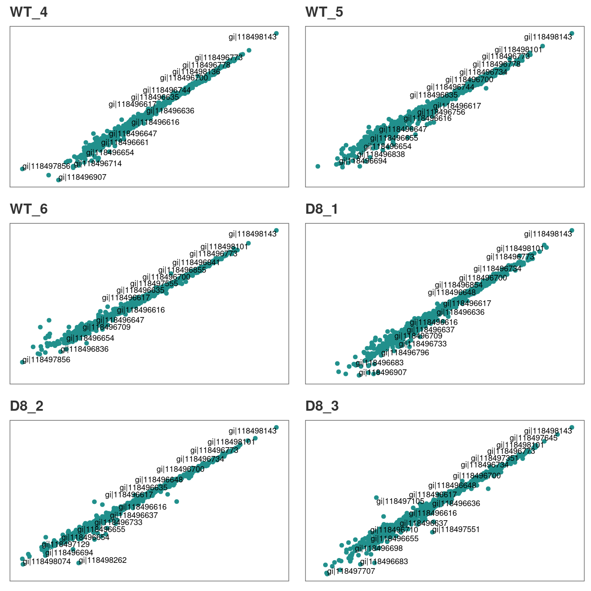
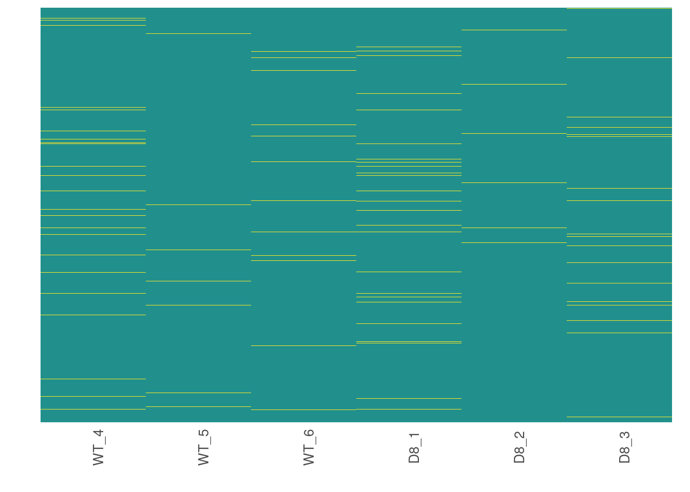
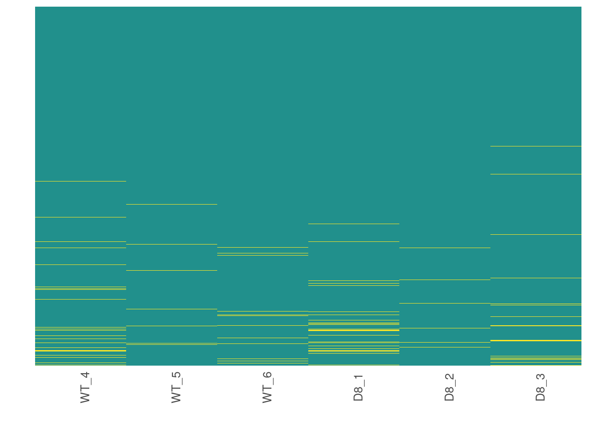
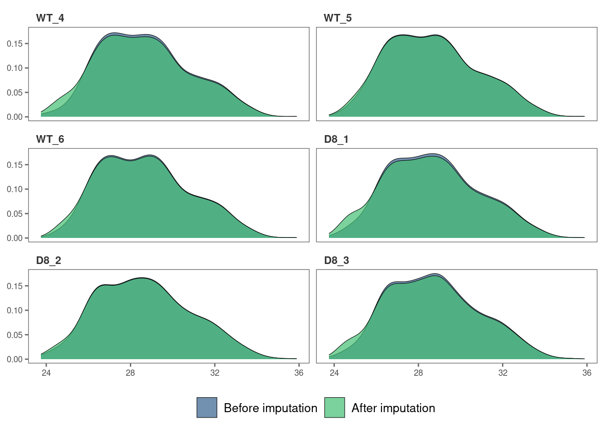
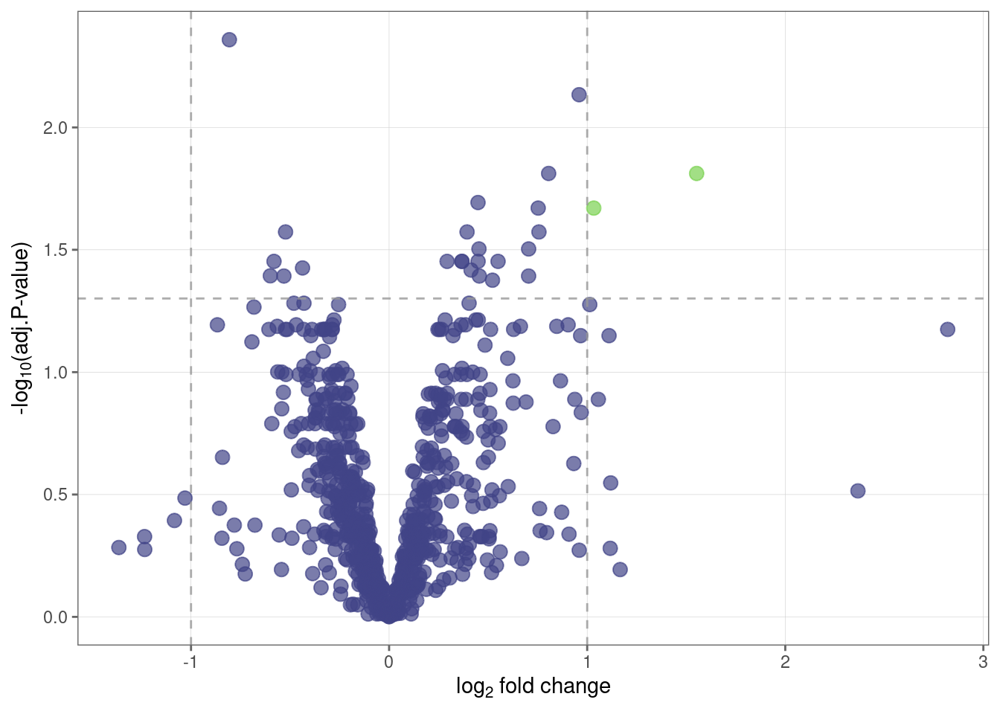
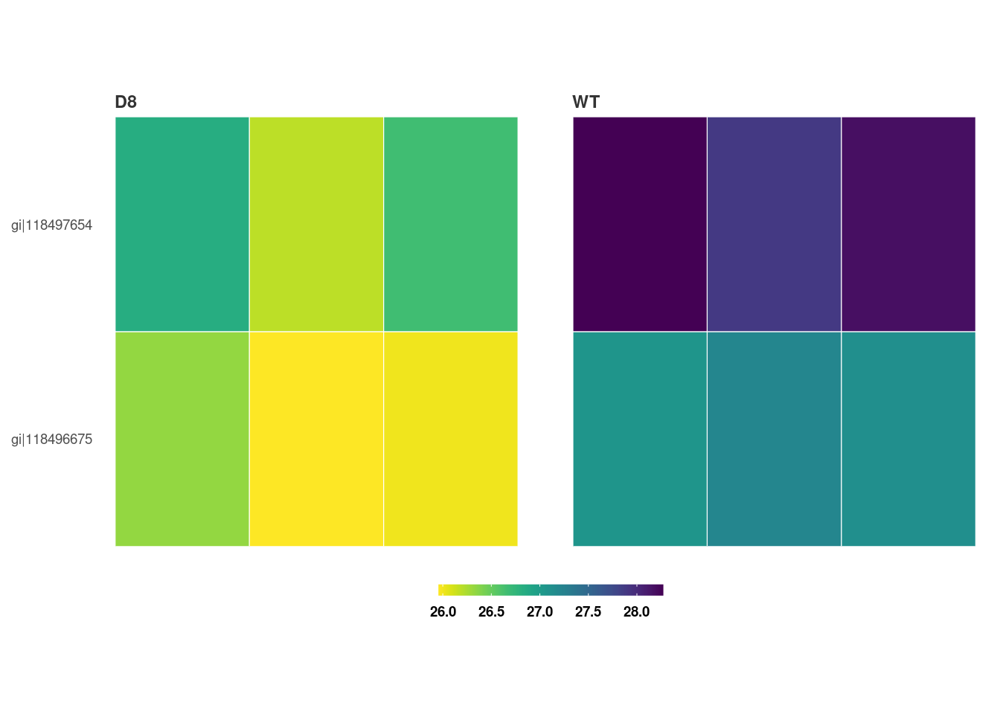

# Proteomics data analysis: technical replicates

### Introduction

This tutorial shows how you can use `promor` to analyse label-free
quantification (LFQ) proteomics data that **contains technical
replicates**.

We recommend that you first go through the simple working example
provided in **Introduction to promor** to get acquainted with `promor`’s
functionality.

``` r
vignette("intro_to_promor")
```

A tutorial for proteomics data **without technical replicates** is
provided here: [promor: No technical
replicates](https://caranathunge.github.io/promor/articles/promor_no_techreps.html)

For this tutorial we will be using a previously published data set from
[Ramond et
al. (2015)](https://www.mcponline.org/article/S1535-9476(20)33188-1/fulltext).
In this experiment there are two conditions or groups (D8 and WT) with
three biological replicates each, and three technical replicates for
each biological replicate.  

------------------------------------------------------------------------

### Workflow

*Figure 1.
A schematic diagram highlighting the suggested promor workflow for
proteomics data with technical replicates*

**You can access the help pages for functions shown above and more
using** `?function_name`

------------------------------------------------------------------------

### Input data

To run *promor*, you need:

- A **proteinGroups.txt** file produced by *MaxQuant* or a **standard
  input file** containing a quantitative matrix of protein intensities.
- An **expDesign.txt** file that contains the experimental design.

**proteinGroups.txt** is one of the output files generated by *MaxQuant*
program. It is a tab-delimited file that contains information on
identified proteins from your peptide data. More information on its
contents can be found in [MaxQuant
Documentation](http://coxdocs.org/doku.php?id=maxquant:table:proteingrouptable).  

**Standard input file** should be a tab-delimited text file. Proteins or
protein groups should be indicated by rows and samples by columns.
Protein names should be listed in the first column and you may use a
column name of your choice for the first column. The remaining sample
column names should match the sample names indicated by the mq_label
column in the expDesign.txt file.  

**expDesign.txt** file is a tab-delimited text file that contains the
design of your experiment. Note that you will have to create and provide
this file when you run *promor* with your own data. Let’s take a look at
the sample *expDesign.txt* file that we will be using for this tutorial.

``` r
# Load promor
library(promor)
# Let's load the expDesign.txt file
exp_design <- read.csv("https://raw.githubusercontent.com/caranathunge/promor_example_data/main/ed2.txt", sep = "\t")
# Take a peek inside the file
head(exp_design, n = 12)
```

**mq_label** is the sample label that you provided when running
*MaxQuant*. You can easily find them in your *proteinGroups.txt* file.
Hint: In LFQ intensity columns, the term “LFQ intensity” is immediately
followed by the label you provided when running *MaxQuant*. This is your
**mq_label**. If you are using a **standard input file** instead of a
proteinGroups.txt file, **mq_label** should match the column headers of
the sample columns.

**condition** is the condition or group that your samples belong to. In
this example “D8” refers to an ∆argP mutant cell line with Arginine
Transporter inactivated and “WT” refers to Wild Type cells.

**sample_ID** is a unique identifier for each sample or biological
replicate.

**tech_rep** is a number denoting the technical replicate number. In
this example, there are three technical replicates for each biological
replicate (see **sample_ID**).

------------------------------------------------------------------------

### 1. Create a *raw_df* object

Let’s first create a *raw_df* object with the input files. Here we will
be using a proteinGroups.txt file produced by MaxQuant. Note: we have
indicated that the data include technical replicates with
`tech_reps = TRUE`.

``` r
# Create a raw_df object with default settings.
raw <- create_df(
  prot_groups = "https://raw.githubusercontent.com/caranathunge/promor_example_data/main/pg2.txt",
  exp_design = "https://raw.githubusercontent.com/caranathunge/promor_example_data/main/ed2.txt",
  tech_reps = TRUE
)
#> 0 empty row(s) removed.
#> 1 empty column(s) removed.
#> 12 reverse protein(s) (rows) removed.
#> 29 protein contaminant(s) (rows) removed.
#> 188 protein(s) identified by 2 or fewer unique peptides removed.
#> Zeros have been replaced with NAs.
#> Data have been log-transformed.
# We can quickly check how the data frame looks like
head(raw)
```

If you ran `create_df` with the default settings, now your *raw_df*
object contains log2 transformed LFQ protein intensity values and zeros
have been converted to NAs. Run
[`?create_df`](https://caranathunge.github.io/promor/reference/create_df.md)
for more information on the available arguments.

------------------------------------------------------------------------

### 2. Correlation plots: technical replicates

Typically, technical replicates for each sample should show strong
correlation. At this stage, we can quickly check if this is the case in
our experiment.

``` r
# Let's first check the correlation between tech.replicates 1 and 2
corr_plot(raw, rep_1 = 1, rep_2 = 2, n_row = 3, n_col = 2, text_size = 12)
```


Similarly, we can visualize the correlation between technical replicates
1 and 3.

``` r
# Correlation between tech.replicates 1 and 3.
corr_plot(raw, rep_1 = 1, rep_2 = 3, n_row = 3, n_col = 2, text_size = 12)
```



You can repeat the analysis for technical replicates 2 and 3 in the same
manner.  

Additionally, if you identify pairs of technical replicates with weak
correlation, those samples or technical replicates can be easily removed
with `rem_sample` at this stage.  

Our technical replicates appear to show strong correlation, therefore we
will use all three per sample to calculate average intensities in the
next step.

------------------------------------------------------------------------

### 3. Average intensities across technical replicates

Now, we are ready to calculate average intensity across technical
replicates for each sample.

``` r
raw_ave <- aver_techreps(raw)

# A quick check on the dimensions of the data frame show that the number of columns is reduced from 18 to 6 as we averaged the tech.replicates.
dim(raw_ave)
#> [1] 1036    6
```

------------------------------------------------------------------------

### 4. Filter proteins by groupwise missing data

Next, we will remove proteins if they have more than 0.4% (default is
0.33%) missing data in either group.

``` r
# Filter out proteins with high levels of missing data in either condition
raw_filtered <- filterbygroup_na(raw_ave, set_na = 0.40)
#> 197 proteins with higher than 40% NAs in at least one group removed.

# We can check the dimensions of the new data frame. Note that the number of rows has changed.
dim(raw_filtered)
#> [1] 839   6
```

------------------------------------------------------------------------

### 5. Visualize missing data

Now, we are going to see how missing data is distributed in the data.

``` r
# Visualize missing data in a subset of proteins.
heatmap_na(raw_filtered)
```



We can reorder proteins by their mean intensity to see if proteins with
low intensity show higher levels of missing data

``` r
# Visualize missing data in a subset of proteins.
heatmap_na(raw_filtered, reorder_y = TRUE)
```



For larger data sets, you can choose to visualize subsets of the data.

``` r
# Visualize missing data in a subset of proteins.
heatmap_na(raw_filtered, protein_range = 1:30, label_proteins = TRUE)
```


------------------------------------------------------------------------

### 6. Impute missing data

*promor* provides multiple missing data imputation methods. Default is
`minProb`, which assumes that all missing data is MNAR (Missing Not at
Random) type. More information about available imputation methods can be
found in [Lazar et
al. (2016)](https://pubs.acs.org/doi/10.1021/acs.jproteome.5b00981).

``` r
# Impute missing data with minProb method. Don't forget to fix the random seed for reproducibility.
imp_df_mp <- impute_na(raw_filtered, seed = 327)
```

**Note: Some missing data imputation methods such as ‘kNN’ require that
the data is normalized prior to imputation.**

------------------------------------------------------------------------

### 7. Visualize imputed data

We can now visualize the impact of imputation on the intensity data.
Lets check the data imputed with the `minProb` method.

``` r
# Visualize the imputed data with a density plot.
impute_plot(original = raw_filtered, imputed = imp_df_mp, global = TRUE)
```


It looks like the distribution of the data was not impacted by the
imputation by much.  

We can also visualize the imputed data of each sample with density
plots.

``` r
# Visualize the imputed data with sample-wise density plots.
impute_plot(original = raw_filtered, imputed = imp_df_mp, global = FALSE, n_row = 3, n_col = 2)
```



------------------------------------------------------------------------

### 8. Normalize data

**Note: As MaxQuant has already normalized protein intensities using the
MaxLFQ algorithm, further normalization may not be necessary for this
data set. Steps 8 and 9 are performed for visualization purposes only.**

Next, we will normalize the imputed data with the default `quantile`
method.

``` r
norm_df <- normalize_data(imp_df_mp)
```

------------------------------------------------------------------------

### 9. Visualize normalized data

Let’s check if our data set was successfully normalized with a density
plot.

``` r
norm_plot(original = imp_df_mp, normalized = norm_df, type = "density")
```


------------------------------------------------------------------------

### 10. Identify differentially expressed proteins

We will be using the non-normalized `imp_df` object we created in **Step
6** to perform differential expression analysis.

``` r
fit_df <- find_dep(imp_df_mp)
#> 2 siginificantly differentially expressed proteins found.
```

You can also choose to save the top 10 hits in a text file as follows:

``` r
fit_df <- find_dep(imp_df_mp, save_tophits = TRUE, n_top = 10)
```

------------------------------------------------------------------------

### 11. Generate a volcano plot

Let’s visualize the results from **Step 10** using a volcano plot.

``` r
volcano_plot(fit_df)
```



------------------------------------------------------------------------

### 12. Create a heatmap of differentially expressed proteins

We can also visualize the top hits from **Step 10** with a heatmap.

``` r
heatmap_de(fit_df, imp_df_mp)
```



Save a copy of the plot in the working directory

``` r
heatmap_de(fit_df, imp_df_mp, save = TRUE, file_path = ".")
```
