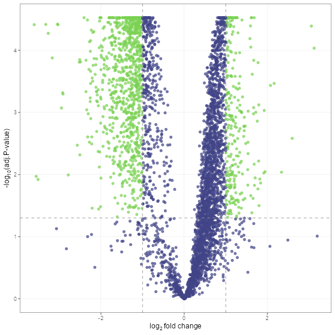

# promor

### Proteomics Data Analysis and Modeling Tools

- `promor` is a user-friendly, comprehensive R package that combines
  proteomics data analysis with machine learning-based modeling.

- `promor` streamlines differential expression analysis of **label-free
  quantification (LFQ)** proteomics data and building predictive models
  with top protein candidates.

- With `promor` we provide a range of quality control and visualization
  tools to analyze label-free proteomics data at the protein level.

- Input files for `promor` are a
  [proteinGroups.txt](https://raw.githubusercontent.com/caranathunge/promor_example_data/main/pg1.txt)
  file produced by [**MaxQuant**](https://maxquant.org) or a [standard
  input
  file](https://raw.githubusercontent.com/caranathunge/promor_example_data/main/st.txt)
  containing a quantitative matrix of protein intensities and an
  [expDesign.txt](https://raw.githubusercontent.com/caranathunge/promor_example_data/main/ed1.txt)
  file containing the experimental design of your proteomics data.

- The standard input file should be a tab-delimited text file. Proteins
  or protein groups should be indicated by rows and samples by columns.
  Protein names should be listed in the first column and you may use a
  column name of your choice for the first column. The remaining sample
  column names should match the sample names indicated by the mq_label
  column in the expDesign.txt file.

🚨**Check out our R Shiny app:** [PROMOR
App](https://sgrbnf.shinyapps.io/PROMOR_App/)

------------------------------------------------------------------------

### Installation

Install the released version from CRAN

``` r
install.packages("promor")
```

Install development version from
[GitHub](https://github.com/caranathunge/promor)

``` r
# install devtools, if you haven't already:
install.packages("devtools")

# install promor from github
devtools::install_github("caranathunge/promor")
```

------------------------------------------------------------------------

### Proteomics data analysis with promor

*Figure 1.
A schematic diagram of suggested workflows for proteomics data analysis
with promor.*

#### Example

Here is a minimal working example showing how to identify differentially
expressed proteins between two conditions using `promor` in five simple
steps. We use a previously published data set from [Cox et
al. (2014)](https://europepmc.org/article/MED/24942700#id609082) (PRIDE
ID: PXD000279).

``` r
# Load promor
library(promor)

# Create a raw_df object with the files provided in this github account.
raw <- create_df(
  prot_groups = "https://raw.githubusercontent.com/caranathunge/promor_example_data/main/pg1.txt",
  exp_design = "https://raw.githubusercontent.com/caranathunge/promor_example_data/main/ed1.txt"
)

# Filter out proteins with high levels of missing data in either condition or group
raw_filtered <- filterbygroup_na(raw)

# Impute missing data and create an imp_df object.
imp_df <- impute_na(raw_filtered)

# Normalize data and create a norm_df object
norm_df <- normalize_data(imp_df)

# Perform differential expression analysis and create a fit_df object
fit_df <- find_dep(norm_df)
```

Lets take a look at the results using a volcano plot.

``` r
volcano_plot(fit_df, text_size = 5)
```



------------------------------------------------------------------------

### Modeling with promor

*Figure
2. A schematic diagram of suggested workflows for building predictive
models with promor.*

#### Example

The following minimal working example shows you how to use your results
from differential expression analysis to build machine learning-based
predictive models using `promor`.

We use a previously published data set from [Suvarna et
al. (2021)](https://www.frontiersin.org/articles/10.3389/fphys.2021.652799/full#h3)
that used differentially expressed proteins between severe and
non-severe COVID patients to build models to predict COVID severity.

``` r
# First, let's make a model_df object of top differentially expressed proteins.
# We will be using example fit_df and norm_df objects provided with the package.
covid_model_df <- pre_process(
  fit_df = covid_fit_df,
  norm_df = covid_norm_df
)

# Next, we split the data into training and test data sets
covid_split_df <- split_data(model_df = covid_model_df)

# Let's train our models using the default list of machine learning algorithms
covid_model_list <- train_models(split_df = covid_split_df)

# We can now use our models to predict the test data
covid_prob_list <- test_models(
  model_list = covid_model_list,
  split_df = covid_split_df
)
```

Let’s make ROC plots to check how the different models performed.

``` r

roc_plot(
  probability_list = covid_prob_list,
  split_df = covid_split_df
)
```


------------------------------------------------------------------------

### Tutorials

You can choose a tutorial from the list below that best fits your
experiment and the structure of your proteomics data.

1.  This README file can be accessed from RStudio as follows,

``` r
vignette("intro_to_promor", package = "promor")
```

2.  If your data do NOT contain technical replicates: [promor: No
    technical
    replicates](https://caranathunge.github.io/promor/articles/promor_no_techreps.html)

3.  If your data contain technical replicates: [promor: Technical
    replicates](https://caranathunge.github.io/promor/articles/promor_with_techreps.html)

4.  If you would like to use your proteomics data to build predictive
    models: [promor:
    Modeling](https://caranathunge.github.io/promor/articles/promor_for_modeling.html)
