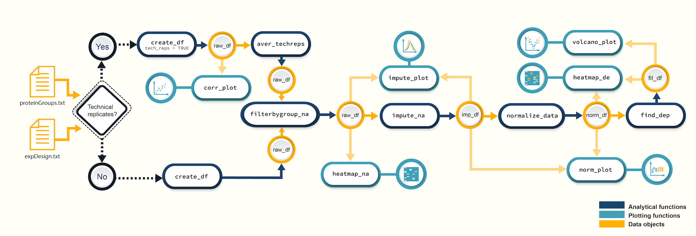
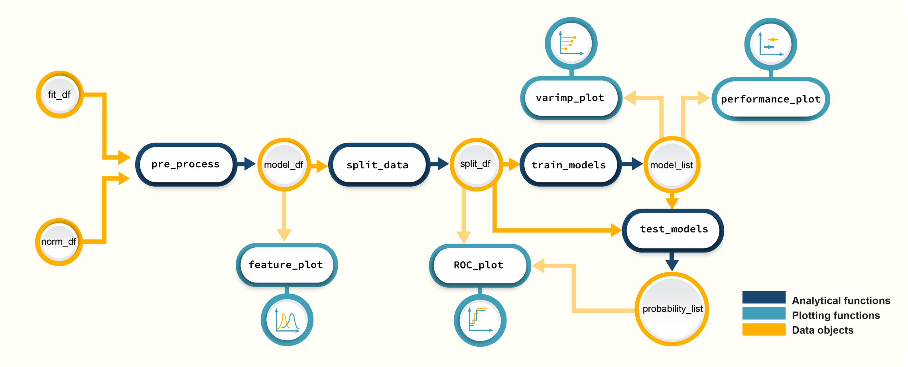

*promor* is an R package that combines proteomics data analysis with machine 
learning-based modeling. Input files for *promor* are the *proteinGroups.txt* 
file produced by *MaxQuant* and an *expDesign.txt* file, which contains the 
experimental design of your proteomics data.  
*promor* provides a wealth of data analysis and visualization tools at the 
protein level to analyze label-free proteomics data.


## Installation

You can install the development version of promor from 
[GitHub](https://github.com/) with:

``` r
# install.packages("devtools")
devtools::install_github("caranathunge/promor")
```

Alternatively, *promor* can be installed directly from a source. First, you 
need to download and save the package files in a local directory. 
Then you may install *promor* as follows:

``` r
install.packages("path/to/promor", repos = NULL, type = "source", dependencies = TRUE)
```
Note: Full path and file name should be provided as "path/to/promor."
For example, if promor is saved on your C drive, 
it could be : `"C://promor_0.1.0.tar.gz"`

## Proteomics data analysis with promor
```{r, echo = FALSE, out.width = "100%"}

```

*Figure 1. A schematic diagram of suggested workflows for proteomics data analysis with promor.*

### Example

Here is a minimal working example that shows how to identify differentially
expressed proteins between two conditions in five simple steps using *promor*. 
We use a previously published data set from [Cox et al. (2014)](https://europepmc.org/article/MED/24942700#id609082).

```{r example, results = 'hide', warning=FALSE}
#Load promor
library(promor)
#Create a raw_df object with the files provided in extdata folder.
raw <- create_df(prot_groups = system.file("extdata", "ecoli_proteinGroups.txt", 
                                           package = "promor"), 
                 exp_design = system.file("extdata", "expDesign.txt", 
                                          package = "promor"))
#Filter out proteins with high levels of missing data in each condition
raw_filtered <- filterbygroup_na(raw)
#Impute missing data and create an imp_df object.
imp_df <- impute_na(raw_filtered)
#Normalize data and create a norm_df object
norm_df <- normalize_data(imp_df)
#Perform differential expression analysis and create a fit_df object
fit_df <- find_dep(norm_df)
```
Lets take a look at the results using a volcano plot.
```{r volcanoplot, warning = FALSE, dpi = 300, out.width = '70%', fig.align ='center'}
 volcano_plot(fit_df, text_size = 5)
```

## Modeling with promor
```{r, echo = FALSE, out.width = "100%"}

```

*Figure 2. A schematic diagram of suggested workflows for building predictive models with promor.*

### Example

The following minimal working example shows you how to use your results from  differential expression analysis to build machine learning-based predictive models using *promor*. 

We use a previously published data set from [Suvarna et al. (2021)](https://www.frontiersin.org/articles/10.3389/fphys.2021.652799/full#h3) that used differentially expressed proteins between severe and non-severe COVID patients to build models to predict COVID severity.

```{r modeling_example, results = 'hide', warning = FALSE,message = F}
#First, let's make a model_df object of top differentially expressed proteins. 
#We will be using example fit_df and norm_df objects provided with the package.
covid_model_df <- pre_process(fit_df = covid_fit_df, 
                              norm_df = covid_norm_df)
#Next, we split the data into training and test data sets
covid_split_df <- split_data(model_df = covid_model_df)

#Let's train our models using the default list of machine learning algorithms
covid_model_list <- train_models(split_df = covid_split_df)

#We can now use our models to predict the test data
covid_prob_list <- test_models(model_list = covid_model_list, 
                               split_df = covid_split_df)
```


Let's make ROC plots to check how the different models performed.

```{r rocplot, warning = FALSE, dpi = 300, out.width = '90%', fig.align ='center', message = F}

roc_plot(probability_list = covid_prob_list,
         split_df = covid_split_df)

```


## Tutorials

You can choose a tutorial from the list below that best fits your experiment 
and the structure of your proteomics data.

1. This README file can be accessed from inside *promor* as follows,

``` r
vignette("intro_to_promor", package = "promor")
```

2. If your data does NOT contain technical replicates:

``` r
vignette("promor_with_notechreps", package = "promor")
```

3. If your data contains technical replicates:

``` r
vignette("promor_with_techreps", package = "promor")
```

4. If you would like to use your proteomics data to build predictive models:

``` r
vignette("promor_for_modeling", package = "promor")
```


