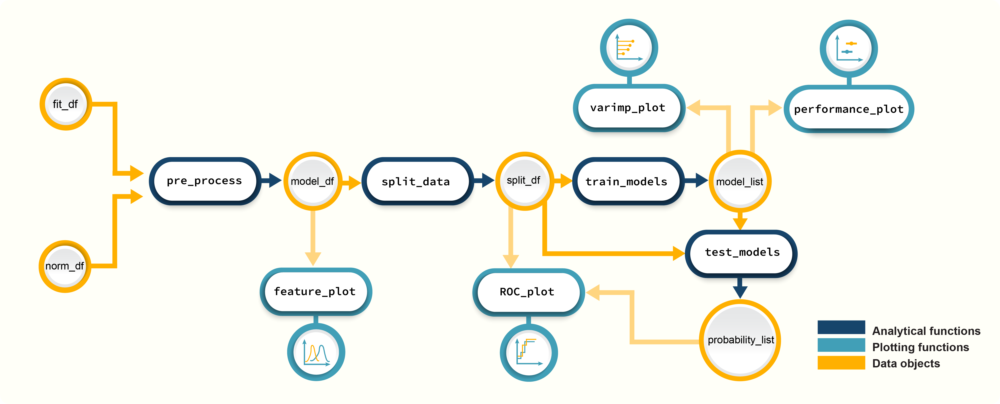

```{r, include = FALSE}
knitr::opts_chunk$set(
  collapse = TRUE,
  comment = "#>"
)
```
This tutorial shows you how you can use *promor* to build predictive models using  top protein candidates identified during differential expression analysis.

We recommend that you first go through the simple working example provided in **Introduction to promor** to get acquainted with *promor*'s functionality.
```{r, eval=FALSE}
vignette("intro_to_promor")
```

A tutorial for **proteomics data without technical replicates** is provided here:
```{r, eval=FALSE}
vignette("promor_with_notechreps")
```

A tutorial for **proteomics data with technical replicates** is provided here:
```{r, eval=FALSE}
vignette("promor_with_techreps")
```

For this tutorial we will be using a previously published data set from [Cox et al. (2014)](https://europepmc.org/article/MED/24942700#id609082).\

## Workflow
 
*Figure 1. A schematic diagram highlighting the suggested promor workflow for building predictive models with protein candidates*

## Input data
To build predictive models with *promor*, you need:

-  A **fit_df** object produced by running `find_dep` for differential expression analysis.
-  An **norm_df** object which is a data frame of normalized protein intensities used as input for `find_dep`.

## 1. Create a *model_df* object
Let's first create a *model_df* object with the example *fit_df* and *norm_df* objects provided with the package. `pre_process` function uses information from the two objects to create a data frame of protein
intensities suitable for modeling.
```{r preprocess, warning=FALSE}

# Load promor
library(promor)

#Create a model_df object with default settings.
model_df <- pre_process(fit_df = ecoli_fit_df,
                        norm_df = ecoli_norm_df, 
                        corr_cutoff = 0.99)
#Let's take a look at the model_df object
head(model_df)
```

As you can see, `pre_process`, by default, finds and removes highly correlated proteins from the
data frame. Alternatively, you can set `find_highcorr = FALSE` and `rem_highcorr = FALSE`, but it is not recommended. You can also tweak the `corr_cutoff` to change the threshold for identifying highly correlated proteins.

## 2. Split data into training and test data sets
Next, we will split the `model_df` object into training and test data sets while maintaining class or condition proportions in each set.
```{r filterbygroupna, warning = FALSE}
#Create a split_df object by splitting data into training and test data set
split_df <- split_data(model_df)
split_df
```


