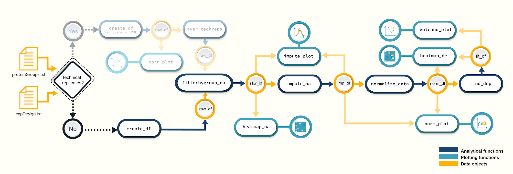

```{r, include = FALSE}
knitr::opts_chunk$set(
  collapse = TRUE,
  comment = "#>"
)
```
This tutorial shows how you can use *promor* to analyse label-free quantification (LFQ) proteomics data that do NOT  contain technical replicates. 

We recommend that you first go through the simple working example provided in **Introduction to promor** to get acquainted with *promor*'s functionality.
```{r, eval=FALSE}
vignette("intro_to_promor")
```

A tutorial for **proteomics data with technical replicates** is provided here:
```{r, eval=FALSE}
vignette("promor_with_techreps")
```

For this tutorial we will be using a previously published data set from [Cox et al. (2014)](https://europepmc.org/article/MED/24942700#id609082).\

## Workflow

 
*Figure 1. A schematic diagram highlighting the suggested promor workflow for proteomics data with no technical replicates*

## Input data
To run *promor*, you need:

-  A **proteinGroups.txt** file produced by *MaxQuant*
-  An **expDesign.txt** file that contains the experimental design.

 **proteinGroups.txt** is one of the output files generated by *MaxQuant* program.  It is a tab-delimited file that contains information on identified proteins from your peptide data. More information on its contents can be found in [MaxQuant Documentation](http://coxdocs.org/doku.php?id=maxquant:table:proteingrouptable).\
 
**expDesign.txt** file is a tab-delimited text file that contains the design of your experiment. Note that you will have to create and provide this file when you run *promor* with your own data. Let's take a look at the sample *expDesign.txt* file that we will be using for this tutorial.

```{r inputfiles}
# Load promor
library(promor)
# Let's load the expDesign.txt file
exp_design <- read.csv("../inst/extdata/expDesign.txt", sep = "\t")
# Take a peek inside the file
head(exp_design)
```

**mq_label** is the sample label that you provided when running *MaxQuant*. You can easily find them in your *proteinGroups.txt* file. Hint: In LFQ intensity columns, the term "LFQ intensity" is immediately followed by the label you provided when running *MaxQuant*. This is your **mq_label**.

**condition** is the condition or group that your samples belong to. In this example "H" refers to HeLa cells, and "L" refers to *E. coli* cells. 

**sample_ID** is a unique identifier for each sample.

**tech_rep** is a number denoting the technical replicate number. In this example, there are no technical replicates, so the column is left blank.

## 1. Create a *raw_df* object
Let's first create a *raw_df* object with the input files. 
```{r createdf, warning=FALSE}
#Create a raw_df object with default settings.
raw <- create_df(prot_groups = system.file("extdata", "ecoli_proteinGroups.txt", 
                                           package = "promor"), 
                 exp_design = system.file("extdata", "expDesign.txt", 
                                          package = "promor"))
# We can quickly check the dimensions of the data frame
dim(raw)
```

If you ran `create_df` with default settings, now your *raw_df* object contains log2 transformed LFQ protein intensity values. Run `?create_df` for more information on available arguments.

## 2. Filter proteins by groupwise missing data
Next, we will remove proteins if they have more than 0.4% (default is 0.33%) missing data in either group.
```{r filterbygroupna, warning = FALSE}
#Filter out proteins with high levels of missing data in each condition
raw_filtered <- filterbygroup_na(raw, set_na = 0.4)
# We can check the dimensions of the new data frame. Note that the number of rows have changed.
dim(raw_filtered)
```

## 3. Visualize missing data
Now, we are going to see how missing data is distributed in the data. This will help us make an informed decision on how to impute missing data in the next step. Because our data object has thousands of proteins, we
will limit the heatmap to 40 proteins for ease of visualization. You can choose to visualize the full data set if you want, but it will be a very large heatmap.

```{r heatmapna, warning = FALSE, results = 'hide', fig.height=7, fig.align = 'center'}
#Visualize missing data in a subset of proteins. 
heatmap_na(raw_filtered, protein_range = 50:90, palette = "mako")
```

Note that your proteins are alphabetically ordered by default, but if you would
rather order them by the mean intensity to check if proteins with low intensities are more likely to have missing data, you can do the following:

```{r heatmapna_1, warning = FALSE, results = 'hide', fig.height=7, fig.align = 'center' }
# Order proteins by mean intensity.
heatmap_na(raw_filtered, protein_range = 50:90, reorder_y = TRUE, y_fun = mean, palette = "mako")
```

## 4. Impute missing data
*promor* provides multiple missing data imputation methods. Default is `minProb`, which assumes that all missing data is MNAR (Missing Not at Random) type or left-censored missing values, and imputes them by random draws from a Gaussian distribution centered at a minimal value. More information about available imputation methods can be found in [Lazar et al. (2016)](https://pubs.acs.org/doi/10.1021/acs.jproteome.5b00981).


```{r imputena, warning = FALSE, results='hide'}
# Impute missing data with minProb method
imp_df_mp <- impute_na(raw_filtered)

#Alternatively, we can test a different imputation method that allows for missing data of both MAR and MNAR types.
imp_df_knn <- impute_na(raw_filtered, method = "kNN")

```

## 5. Visualize imputed data
We can now visualize the impact of imputation on each sample's intensity data. 
First, lets check the data imputed with `minProb` method.

```{r imputeplotmp, warning = FALSE, results='hide', fig.align = 'center', dpi = 300}
# Visualize the imputed data with sample-wise density plots.
impute_plot(original = raw_filtered, imputed = imp_df_mp, global = FALSE, nrow = 3, ncol = 3, palette = "mako")
```

It looks like, for most samples, imputation has not changed the distribution of data by much, which is a good sign. However, sample `H_3` seems to have been imputed with a fair amount of low intensity values.\

Let's look at the data imputed with the `kNN` method next.

```{r imputeplotrf, warning = FALSE, results='hide', fig.align = 'center', dpi = 300}
# Visualize the imputed data with sample-wise density plots.
impute_plot(original = raw_filtered, imputed = imp_df_knn, global = FALSE, nrow = 3, ncol = 3, palette = "mako")
```

Compared to `minProb`, `kNN` seems to have introduced fewer low intensity values to `H_3` data, so let's use that data set in downstream steps.

## 6. Normalize data

Next, we will normalize the imputed data with the default `quantile` method.
```{r norm, warning = FALSE, results='hide'}
norm_df <- normalize_data(imp_df_knn)
```

## 7. Visualize normalized data
Let's check if our data set was successfully normalized.
```{r normplot, warning = FALSE, results = 'hide', fig.align = 'center'}
norm_plot(original = imp_df_knn, normalized = norm_df, palette = "mako")
```
For samples that show very little variability among them, such as those in this data set, it may be difficult to visualize the effect of normalization with boxplots. Let's use `type = "density` to visualize the effect of normalization with density plots instead.
```{r normplotd, warning = FALSE, results = 'hide', fig.align = 'center'}
norm_plot(original = imp_df_knn, normalized = norm_df, type = "density", palette = "mako")
```


## 8. Identify differentially expressed proteins
We can now use the `norm_df` object we created in **Step 7** to perform differential expression analysis.

```{r finddep, warning = FALSE, results = 'hide'}
fit_df <- find_dep(norm_df)
```

You can also choose to save the top 10 hits in a text file as follows:
```{r tophits, warning = FALSE, eval = FALSE, results = 'hide'}
fit_df <- find_dep(norm_df, save_tophits = TRUE, n_top = 10)
```


## 9. Generate a volcano plot
Let's visualize the results from **Step 8** using a volcano plot.


```{r volcanoplot, warning = FALSE, results ='hide', out.width = '70%', fig.align ='center'}
volcano_plot(fit_df, 
             text_size = 5,
             palette = "mako")
```

## 10. Create a heatmap of differentially expressed proteins

```{r heatmapde, warning = FALSE, results ='hide', fig.align = 'center'}
heatmap_de(fit_df = fit_df, norm_df = norm_df, palette = "mako")
```


